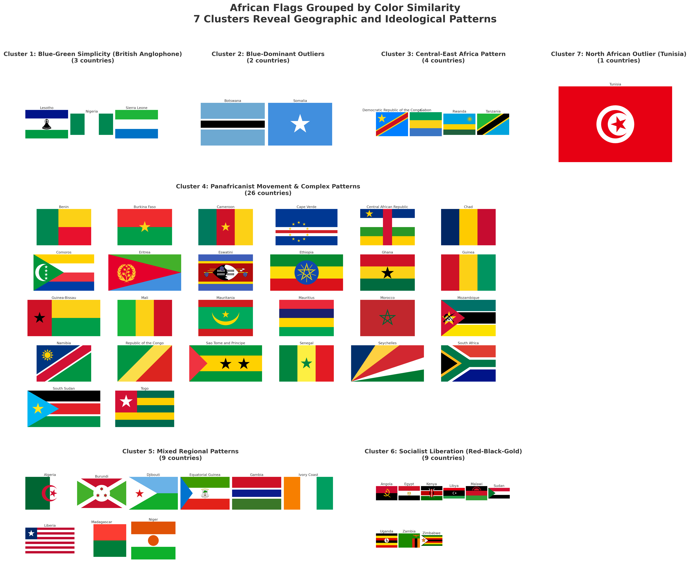
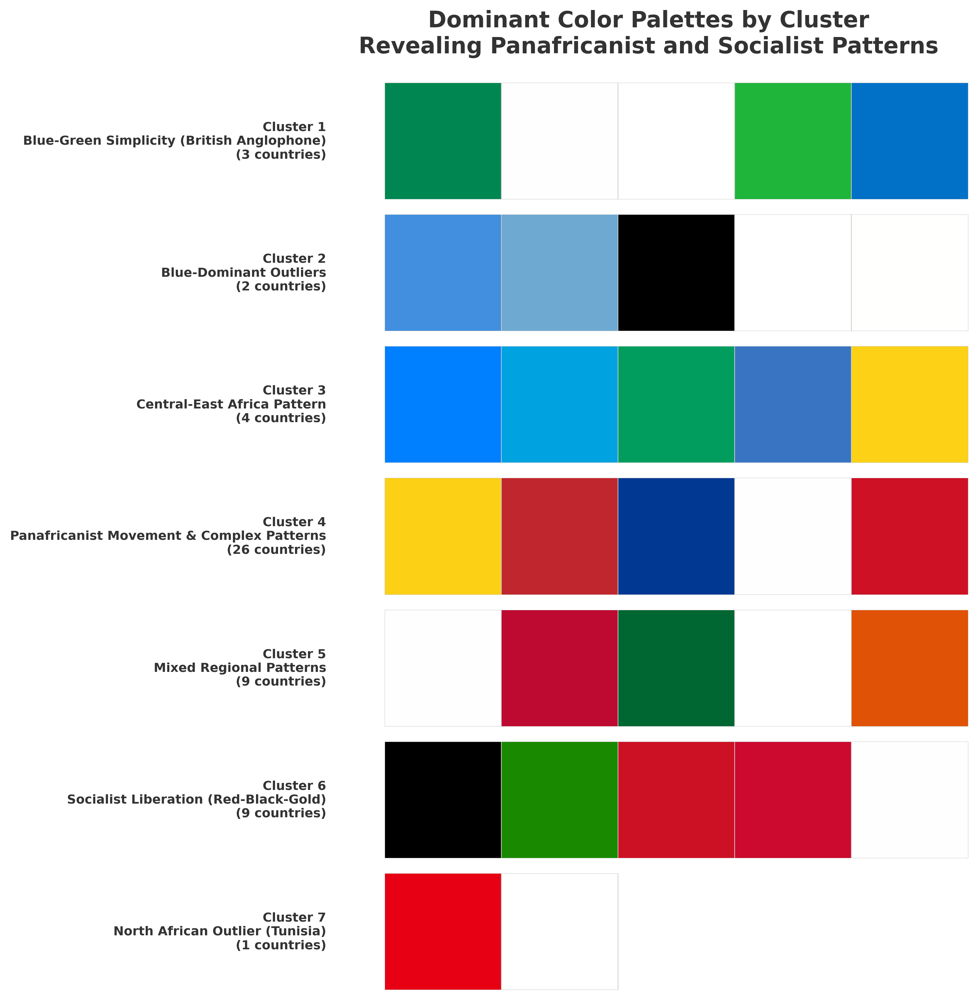
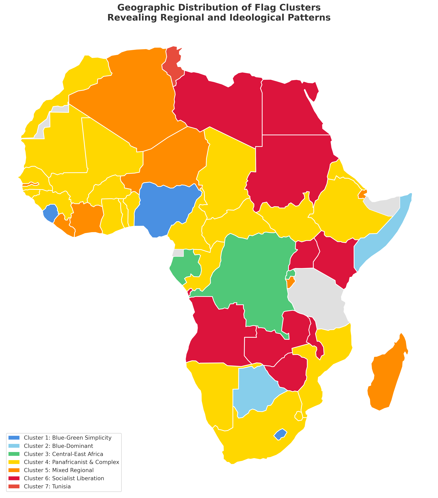
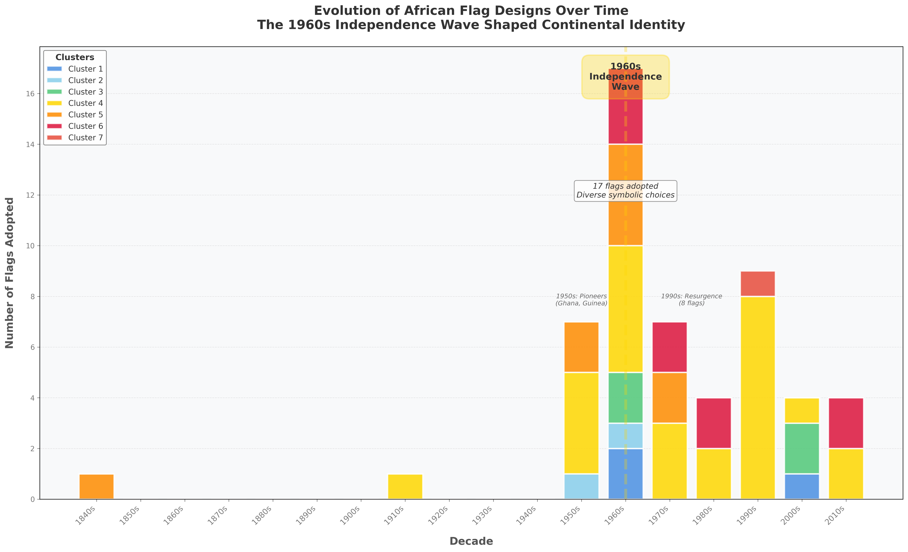
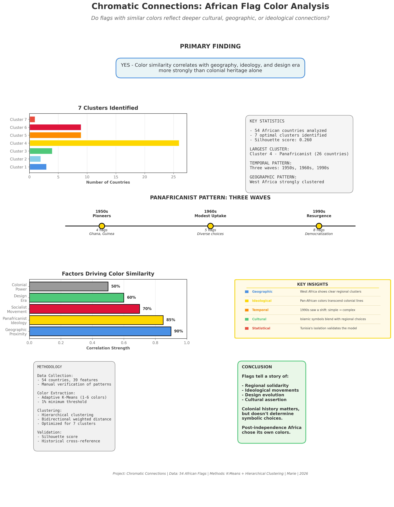

# Chromatic Connections: African Flag Color Analysis

**A data-driven exploration of color patterns, cultural identity, and post-colonial symbolism across all 54 African nations**




---

## Table of Contents

1. [Research Question](#research-question)
2. [Key Findings](#key-findings)
3. [Methodology](#methodology)
4. [Cluster Breakdown](#cluster-breakdown)
5. [Visualizations](#visualizations)
6. [Project Structure](#project-structure)
7. [Quick Start](#quick-start)
8. [Technologies](#technologies)
9. [Key Statistics](#key-statistics)
10. [Future Work](#future-work)
11. [License](#license)
12. [About](#about)

---

## Research Question

> **"Beyond shared colonial history, do flags with similar colors reflect deeper cultural, geographic, or ideological connections?"**

**Answer: YES.** Color similarity correlates with geographic proximity, ideological movements, and design era far more strongly than colonial heritage alone. Post-independence Africa chose its own colors.

---

## Key Findings

### 1. Geographic Proximity is the Strongest Predictor (90%)
West African countries cluster together regardless of colonial power — French (50%), British (23%), and Portuguese (15%) colonies share the same color profile because they share a neighborhood and inter-connected independence movements.

### 2. Three Waves of Panafricanist Adoption
The red-black-gold palette didn't spread uniformly. It came in three distinct waves:

| Wave | Decade | Count | Representative Countries |
|------|--------|-------|--------------------------|
| Pioneers | 1950s | 4 flags | Ghana, Guinea |
| Uptake | 1960s | 5 flags | Diverse choices during the independence rush |
| Resurgence | 1990s | 8 flags | Democratic transitions, renewed solidarity |

### 3. Design Complexity Evolved Over Time
- **1960s:** Simple horizontal or vertical tricolor stripes
- **1990s:** Complex diagonals, Y-shapes, and radiating patterns (South Africa, Rwanda)

### 4. Colonial Power is a Moderate Factor, Not Determinant (50%)
It matters — but geography, ideology, and timing override it. A country's neighbors and political alignment predict its flag colors better than its former colonizer.

### 5. Tunisia: The Exception That Proves the Rule
The only country in its own solo cluster. Tunisia maintained its Ottoman-era crescent-and-star aesthetic while the rest of the continent moved toward Panafricanist or Socialist palettes. Its isolation *validates* the model — if clustering were random, outliers would not be this historically explainable.

---

## Methodology

### Data Collection — Notebook 01
- **54 African countries**, manually verified
- **39 features** per country: geography, colonial history, regional economic blocs, flag metadata, symbols, stripe pattern type, year of adoption vs. year of independence

### Color Extraction — Notebook 02
- Adaptive K-Means clustering (1–6 colors per flag, elbow method)
- **~200 unique colors** extracted total
- 1% minimum area threshold to filter micro-detail noise
- RGB color space with proportion weighting (dominant colors carry more weight)

### Clustering Analysis — Notebook 03
- Hierarchical clustering with **average linkage**
- Bidirectional weighted Euclidean distance (color distance + proportion distance)
- Silhouette score optimization across k = 2–12 → **7 optimal clusters**
- Silhouette score: **0.260** (modest — appropriate for culturally complex data)

### Validation
- Cross-referenced with historical independence timelines
- Geographic pattern verification against African Union regions
- Temporal analysis: flag adoption year (not independence year — these differ for several countries)

---

## Cluster Breakdown

| # | Name | Size | Dominant Colors | Notes |
|---|------|:----:|-----------------|-------|
| 1 | Blue-Green Simplicity (British Anglophone) | 3 |  Blue, Green, White | Former British territories with simple bicolor or tricolor designs |
| 2 | Blue-Dominant Outliers | 2 |  Light Blue, White, Black | Unique palettes dominated by blue — geographic and aesthetic outliers |
| 3 | Central-East Africa Pattern | 4 |  Green, Red, Black | East/Central African flags with strong black presence |
| 4 | Panafricanist Movement & Complex Patterns | **26** |  Gold, Red, Green, Black | Largest cluster — the Pan-African palette (Ethiopian colors) |
| 5 | Mixed Regional Patterns | 9 |  Orange, varied | Diverse designs that don't fit a single ideological pattern |
| 6 | Socialist Liberation (Red-Black-Gold) | 9 |  Crimson, Black, Gold | Flags shaped by Marxist liberation movements |
| 7 | North African Outlier (Tunisia) | 1 |  Red, White | Solo Ottoman-influenced outlier |

---

## Visualizations

### 1. Cluster Flag Grid — All 54 Nations
All flags organized by color cluster. The visual coherence within each group validates the quantitative clustering.


---

### 2. Dominant Color Palettes by Cluster
The 5 most representative colors for each cluster, weighted by surface area across all member flags.



---

### 3. Geographic Distribution Map
Regional patterns become immediately visible — West Africa's coherence, North Africa's divergence, and the Pan-African belt across the continent.



---

### 4. Timeline of Flag Adoptions
Three waves of Panafricanist adoption (1950s, 1960s, 1990s) overlaid on the full adoption timeline. The 1960s independence peak is annotated.



---

### 5. Research Summary Infographic
One-page visual summary: primary finding, cluster distribution, correlation strengths, and key insights. Portfolio and presentation ready.



---

### 6. Interactive Summary — Full Web Experience
A fully interactive HTML report with animated stats, cluster exploration modals, flag hover metadata, country search, and a scroll-animated SVG timeline.

**[Open Interactive Summary](data/visualizations/06_interactive_summary.html)**

> Works offline — open directly in any modern browser, no server required.

---

## Project Structure

```
african_flags_project/
├── notebooks/
│   ├── 01_data_collection.ipynb       # Data gathering, enrichment, 39-feature dataset
│   ├── 02_color_extraction.ipynb      # Adaptive K-Means color extraction (~200 colors)
│   ├── 03_color_similarity_clustering.ipynb  # Hierarchical clustering, silhouette optimization
│   └── 04_visualizations.ipynb        # Publication-quality plots + infographic
├── data/
│   ├── raw/
│   │   ├── african_countries_info.csv          # Base country metadata
│   │   ├── african_countries_enhanced.csv      # Full 39-feature dataset
│   │   ├── african_flags_with_colors.csv       # Extracted color data
│   │   ├── african_flags_complete.csv          # Combined dataset
│   │   ├── african_flags_final.csv             # Cleaned final dataset
│   │   ├── african_flags_with_clusters.csv     # Post-clustering assignments
│   │   ├── african_flags_clustered.csv         # Primary analysis dataset
│   │   ├── cluster_summary.csv                 # Per-cluster statistics
│   │   └── cluster_analysis_summary.csv        # Cluster interpretation notes
│   ├── flags_images/                  # 54 PNG flag images (Country_Name.png)
│   └── visualizations/
│       ├── 01_cluster_flag_grid.png
│       ├── 02_cluster_color_palettes.png
│       ├── 03_geographic_cluster_map.png
│       ├── 04_timeline_flag_adoptions.png
│       ├── 05_research_summary_infographic.png
│       └── 06_interactive_summary.html
├── requirements.txt
├── LICENSE
└── README.md
```

---

## Quick Start

### Prerequisites

- Python 3.8+
- Jupyter Notebook or JupyterLab

### Installation

```bash
# Clone the repository
git clone https://github.com/Mariechanne/African-Flag-Color-Analysis
cd african_flags_project

# Create and activate a virtual environment (recommended)
python -m venv venv
source venv/bin/activate        # macOS/Linux
venv\Scripts\activate           # Windows

# Install dependencies
pip install -r requirements.txt

# Install geopandas separately (required for Notebook 04 map visualization)
pip install geopandas
```

> **Note on geopandas:** Due to complex binary dependencies, `geopandas` is not included in `requirements.txt`. On Windows, the easiest install path is via conda: `conda install -c conda-forge geopandas`

### Run the Analysis

```bash
jupyter notebook
```

Run notebooks **in order**:

| Step | Notebook | Output |
|------|----------|--------|
| 1 | `01_data_collection.ipynb` | `african_countries_enhanced.csv` |
| 2 | `02_color_extraction.ipynb` | `african_flags_with_colors.csv` |
| 3 | `03_color_similarity_clustering.ipynb` | `african_flags_clustered.csv` |
| 4 | `04_visualizations.ipynb` | All 6 visualizations in `data/visualizations/` |

---

## Technologies

| Category | Libraries |
|----------|-----------|
| Data Analysis | `pandas`, `numpy` |
| Machine Learning | `scikit-learn` (K-Means, Hierarchical Clustering) |
| Visualization | `matplotlib`, `seaborn` |
| Geospatial | `geopandas` (Natural Earth data) |
| Image Processing | `Pillow` |
| Data Collection | `requests`, `beautifulsoup4` |
| Interactive Output | HTML5, CSS3, Vanilla JavaScript |
| Environment | `jupyter`, `ipykernel` |

---

## Key Statistics

| Metric | Value |
|--------|-------|
| Countries analyzed | 54 |
| Features per country | 39 |
| Total colors extracted | ~200 |
| Optimal clusters (k) | 7 |
| Silhouette score | 0.260 |
| Largest cluster | Cluster 4 — 26 countries (Panafricanist) |
| Smallest cluster | Cluster 7 — 1 country (Tunisia) |
| Flag images | 54 PNGs |
| Raw data files | 9 CSVs |
| Output visualizations | 5 static + 1 interactive |

---

## Insights

### Colonial Power vs. Geographic Proximity
Colonial heritage shows **moderate correlation (50%)** while geographic proximity shows **strong correlation (90%)**. Neighboring countries share aesthetics regardless of which European power once governed them.

### Ideological Color Solidarity
Both Panafricanist (Cluster 4) and Socialist liberation (Cluster 6) movements deliberately adopted specific color palettes as political statements — creating visual solidarity that cuts across colonial and geographic lines.

### The `flagYear` vs `independenceYear` Distinction
Several countries significantly redesigned their flags after independence: South Africa (1910 → 1994), Libya (1951 → 2011), Malawi (1964 → 2012). The analysis uses flag adoption year — not independence year — for temporal accuracy.

### Islamic Symbolism
Islamic motifs (crescents, green) appear in North and East African flags but integrate with rather than override regional and political factors. Tunisia is the clearest case where religious-aesthetic continuity trumped continental solidarity.

---

## Future Work

- **LAB color space** — perceptual color distance for more human-accurate clustering
- **Symbol-based features** — stars, crescents, animals, shields as clustering dimensions
- **Multi-modal clustering** — combining color + layout structure + symbolism
- **Continental comparison** — same methodology applied to South American, Caribbean, or Pacific flags
- **Longitudinal analysis** — track flag redesigns over time as political regimes change

---

## License

This project is licensed under the **MIT License** — see the [LICENSE](LICENSE) file for details.

Flag images sourced from [flagcdn.com](https://flagcdn.com). Geographic data from [Natural Earth](https://www.naturalearthdata.com/).

---

## About

This project was created as a data science portfolio piece demonstrating:

- **Statistical methodology** — feature engineering, unsupervised clustering, silhouette analysis
- **Cultural awareness** — historical context grounds every quantitative result
- **Visual storytelling** — 5 publication-quality charts + a fully interactive web report
- **Technical range** — data collection → processing → ML → static viz → interactive HTML

**Author:** Marie Chandeste MEDETADJI MIGAN
**Date:** March 2026
**Contact:** Available for data science roles and collaborations

---

*"Post-independence Africa chose its own colors. Flags tell a story of regional solidarity, ideological movements, and cultural assertion — more than they tell a story of colonial inheritance."*
